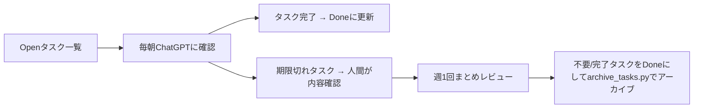

# タスク管理システムの知見

## システムの基本構造
- タスクはJSONファイルで管理され、階層構造を持つ
- 各タスクは一時ID（TXXXX）と永続ID（UUID）の2種類のIDを持つ
  - 一時ID：人間とのやり取り用（10,000個）
  - 永続ID：システム内部の関係性管理用（UUID）
- タスクの依存関係はDAG（有向非循環グラフ）として表現
  - たとえ「サブタスク」という言葉で呼ばれたとしても、親タスクがサブタスク(子タスク)を所有するのではなく、対等なタスクに参照関係があるだけである
- プロジェクトとタスクはデータ構造上の明確な区別を持たない
  - プロジェクトの方が長期的にたくさんのタスクを生みつつ実行されがちであり、タスクの方が単発で完了しがちであるが、タスクのつもりであったものが大きなプロジェクトに育つことがある

## 依存関係の種類
1. MUST依存
   - タスクの完了に必須の依存関係
   - 明確な理由を必要とする

2. NICE_TO_HAVE依存
   - タスクの実行を助けるが、必須ではない依存関係
   - 効率化のための参照として使用

3. 人的依存（HUMAN）
   - 人間の判断や承認が必要な依存関係
   - ブロッキング理由の明確化が重要
   - assigneeが自分以外の場合は他者待ち状態として扱う
   - 定期的な状態確認と最終確認時刻の記録が必要

## タスクの重複・類似性
- タスクの重複は自動検出される
- 類似タスクは必要に応じてマージ可能
- マージ時は履歴を保持し、元のタスクIDを記録

## AIインスタンスの役割分担
1. タスク受付・整理インスタンス
   - チャットからのタスク抽出
   - タスクの分類と構造化
   - 重複・類似性のチェック

2. システム改善インスタンス
   - システムの機能拡張
   - ドキュメント更新
   - プロセス改善の提案

## タスク記録のベストプラクティス
1. タスク追加時のチェック項目
   - 一意のID割り当て
   - 適切な依存関係の設定
   - 明確な説明と目的の記述
   - ラベルと担当者の設定

2. タスクの状態管理
   - Open: 新規作成されたタスク
   - Done: 完了したタスク

### タスク状態管理 (補足)

現在は **Open** と **Done** の2種類のみ使用します。

- **Open**: 作業対象のタスク。  
- **Done**: 完了したタスク。  

#### 期限切れタスク
- `due_date` が過ぎたタスクは、定期的に人間によるチェックが入ります。  
- 必要なら作業を続行し、不要となれば「Done」にするか破棄します。

#### 状態変更の運用
- 朝にChatGPTへ「今日やること」を確認し、すでに完了しているものは「Done」に更新します。
- 週1回、人間がまとめて `backlog.json` をレビューし、不要タスクや完了タスクを整理します。

#### 運用フロー例

3. タスクの優先順位付け
   - 依存関係グラフに基づく順序付け
   - 人的依存の解決を優先
   - クリティカルパスの識別

## システムの制約と注意点
1. 永続化の原則
   - すべての重要な情報はGitHubのファイルとして保存
   - チャットでの議論は適切にタスク化

2. 一元管理の原則
   - タスク情報は単一のリポジトリで管理
   - 複数リポジトリへの分散を避ける

3. 文書化の原則
   - タスクの文脈や背景の明確な記録
   - 依存関係の理由の明示
   - システムの知見の継続的な更新
